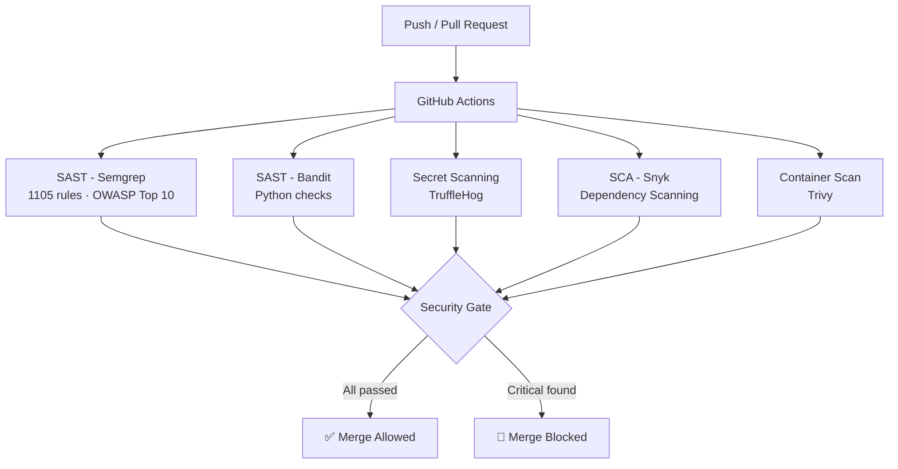

# 🔐 DevSecOps Security Gates Pipeline


> CI/CD Security Pipeline that scans every commit for vulnerabilities in source code, dependencies, and Docker images. Automatically blocks merges when critical security issues are detected.

---

## 📌 Overview

This project demonstrates a real-world **DevSecOps pipeline** using GitHub Actions with automated security gates. It integrates 5 industry-standard security tools running in parallel on every push or pull request, blocking merges automatically when critical vulnerabilities are found.

The project includes two branches to demonstrate the **full DevSecOps cycle**:
- `main` — intentionally vulnerable code (pipeline detects and blocks)
- `develop` — remediated code (pipeline passes all checks ✅)

---

## 🛠️ Security Stack

| Tool | Type | What it detects |
|---|---|---|
| **Semgrep** | SAST | Code vulnerabilities, OWASP Top 10, secrets |
| **Bandit** | SAST | Python-specific security issues |
| **TruffleHog** | Secret Scanning | Exposed credentials and secrets in git history |
| **Snyk** | SCA | CVEs in third-party dependencies |
| **Trivy** | Container Security | CVEs in Docker images and OS packages |

---

## 🏗️ Pipeline Architecture



---

## 🔄 Branch Strategy

| Branch | Code | Pipeline | Purpose |
|---|---|---|---|
| `main` | ❌ Vulnerable | 🔴 Blocked | Demonstrates threat detection |
| `develop` | ✅ Secure | ✅ Passed | Demonstrates remediation |

---

## 🚨 Vulnerabilities Detected in `main`

| Vulnerability | Location | Tool | Severity |
|---|---|---|---|
| SQL Injection | `src/app.py` line 14 | Semgrep + Bandit | 🔴 High |
| Command Injection | `src/app.py` line 20 | Semgrep + Bandit | 🔴 High |
| Weak Hashing (MD5) | `src/app.py` line 25 | Semgrep + Bandit | 🟡 Medium |
| Insecure Deserialization | `src/app.py` line 29 | Bandit | 🔴 High |
| Hardcoded Secrets | `src/app.py` line 32-33 | Semgrep | 🔴 High |
| Outdated Dependencies | `src/requirements.txt` | Snyk | 🔴 Critical CVEs |
| Container CVEs | `docker/Dockerfile` | Trivy | 🔴 Critical |

---

## ✅ Fixes Applied in `develop`

| Vulnerability | Fix |
|---|---|
| SQL Injection | Parameterized queries |
| Command Injection | Removed `shell=True`, input allowlist |
| Weak Hashing | Replaced MD5 with `pbkdf2_hmac` + salt |
| Insecure Deserialization | Replaced `pickle` with `json` |
| Hardcoded Secrets | Moved to environment variables |
| Outdated Dependencies | Updated to latest secure versions |
| Container CVEs | Upgraded base image to `python:3.13-slim` |

---

## 📊 Pipeline Results Comparison

| Scanner | `main` | `develop` |
|---|---|---|
| Semgrep | 🔴 3 blocking findings | ✅ Clean |
| Bandit | 🔴 2 High, 2 Medium | ✅ Clean |
| TruffleHog | ✅ Clean | ✅ Clean |
| Snyk | ✅ Clean | ✅ Clean |
| Trivy | 🔴 Critical CVEs | ✅ Clean |
| **Security Gate** | 🔴 **Blocked** | ✅ **Passed** |

---

## 📁 Project Structure

```
devsecops-security-gates/
│
├── .github/
│   └── workflows/
│       └── security-pipeline.yml   # Main CI/CD pipeline
│
├── src/
│   ├── app.py                      # Vulnerable (main) / Secure (develop)
│   └── requirements.txt            # Outdated (main) / Updated (develop)
│
├── docker/
│   ├── Dockerfile                  # Docker image for container scanning
│   └── .trivyignore                # Documented unfixable OS CVEs
│
├── .trivyignore                    # Trivy ignore rules
└── README.md
```

## ⚙️ How the Security Gate Works

1. Every `push` or `pull request` triggers the pipeline
2. All 5 scanners run **in parallel** to save time
3. If **Bandit** or **TruffleHog** detect critical issues → merge is **blocked**
4. The **Security Gate** job only passes if all required checks succeed
5. Developers get immediate feedback with detailed reports

---

## 🚀 Run Locally

```bash
# Clone the repository
git clone https://github.com/VladimirRamirez07/devsecops-security-gates.git
cd devsecops-security-gates

# Install tools
pip install bandit semgrep

# Run Bandit
bandit -r src/ -ll

# Run Semgrep
semgrep --config=p/python --config=p/secrets src/

# Run Trivy (requires Docker)
docker build -f docker/Dockerfile -t devsecops-app .
trivy image devsecops-app
```

---

## 🔧 Requirements

- GitHub account with Actions enabled
- Docker (for container scanning)
- Python 3.9+
- Secrets configured in GitHub:
  - `SEMGREP_APP_TOKEN`
  - `SNYK_TOKEN`

---

## 📚 What I Learned

- Integrating 5 security scanners in a single CI/CD pipeline
- Configuring automated security gates that block unsafe merges
- Identifying and remediating OWASP Top 10 vulnerabilities in Python
- Container security scanning and CVE management with Trivy
- Secret detection across git history with TruffleHog
- Managing unfixable OS-level CVEs with documented exceptions

---

## 👨‍💻 Author

**Vladimir Ramirez**

[](https://github.com/VladimirRamirez07)
[](https://www.linkedin.com/in/vladimir-ramírez-303a433ba)

---

## 📄 License

This project is licensed under the MIT License — see the [LICENSE](LICENSE) file for details.